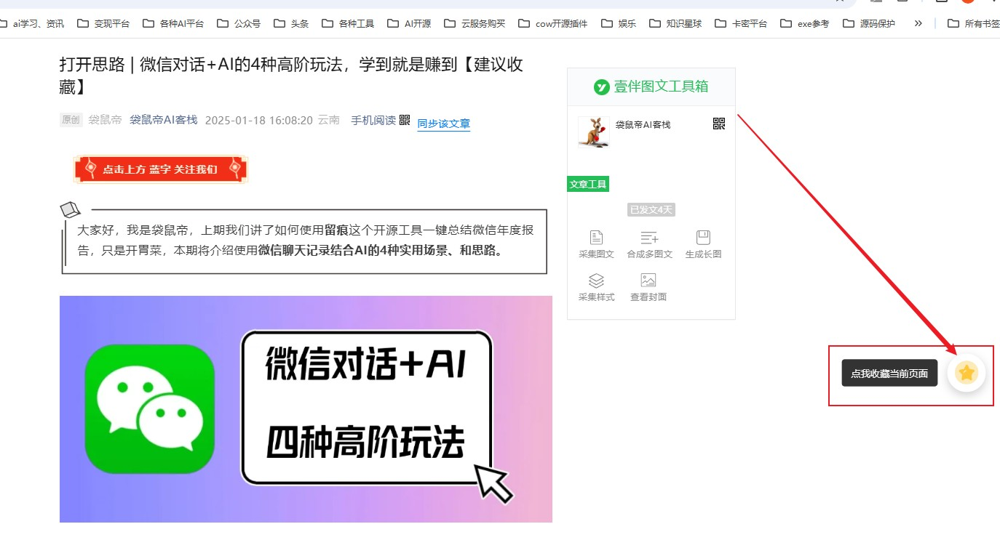
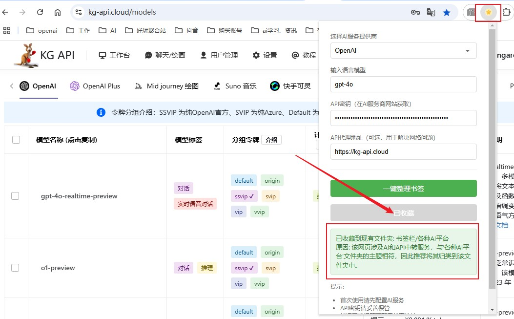
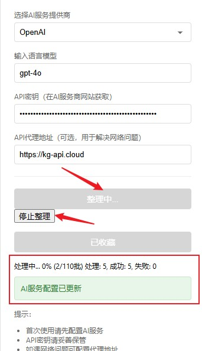

# Bookmark Sage（书签智者） 是一个AI驱动的智能书签管理器

## 项目简介
Bookmark Sage 是一个基于 AI 的 Chrome 浏览器扩展，能够智能地管理和组织您的浏览器书签。它使用 AI 技术自动分析网页内容，为书签推荐最合适的书签分类，帮助用户保持书签结构的整洁与条理。

## 产品展示
### 智能收藏页面（悬浮球）

*一键智能收藏，AI 自动推荐最合适的书签分类*

### 智能收藏页面（插件窗口按钮）

*一键智能收藏，AI 自动推荐最合适的书签分类*

### 批量整理书签

*智能批量整理功能，让您的书签体系焕然一新*

## 主要功能
- 🤖 智能书签分类：自动分析网页内容并推荐合适的文件夹
- 📚 批量书签整理：一键整理所有现有书签到合适的分类中
- ⚡ 快速收藏：便捷的一键智能收藏功能
- 🎯 精准推荐：基于 AI 分析的智能文件夹推荐
- 🔄 实时进度：清晰的整理进度显示
- ⏹️ 随时暂停：支持暂停和继续整理操作

## 安装说明
1. 下载项目代码
2. 打开 Chrome 浏览器，进入扩展程序页面 (chrome://extensions/)
3. 开启"开发者模式"
4. 点击"加载已解压的扩展程序"
5. 选择项目文件夹即可完成安装

## 使用指南
1. 配置 AI 服务
   - 点击扩展图标打开设置面板
   - 选择 AI 服务提供商（目前支持 OpenAI）
   - 输入 API Key
   - 可选：配置代理地址，推荐使用 https://kg-api.cloud/ 作为稳定可靠的 AI 代理服务

2. 一键整理书签
   - 点击"一键整理书签"按钮
   - 等待 AI 分析并自动整理
   - 可随时点击"停止整理"暂停操作

3. 收藏当前页面
   - 在任意网页点击扩展图标
   - 点击"收藏当前页面"
   - AI 将自动推荐合适的文件夹
   - 或者直接点击页面右侧的收藏悬浮球，进行智能页面收藏

## 项目结构 
bookmark-sage/
├── src/
│ ├── popup/ # 弹出窗口相关代码
│ ├── background/ # 后台服务相关代码
│ ├── content/ # 内容脚本
│ └── utils/ # 工具类
├── assets/ # 图标等资源文件
└── manifest.json # 扩展配置文件

## 配置说明
1. AI 服务配置
   - API Key：您的 OpenAI API 密钥
   - 代理地址：（可选）如果需要代理访问 AI 服务
   - 模型选择：支持多种 OpenAI 模型
   - 推荐使用 https://kg-api.cloud/ 作为稳定可靠的 AI 代理服务（可选市面上所有主流大模型）

2. 书签管理
   - 支持批量处理
   - 可自定义处理批次大小
   - 支持进度显示和日志记录

## 注意事项
- 请确保您有有效的 OpenAI API Key（或者代理服务key）
- 首次使用需要配置 AI 服务
- 大量书签整理可能需要较长时间
- 建议在一键整理书签前备份所有书签

## 贡献指南
欢迎提交 Issue 和 Pull Request 来帮助改进项目。

## 许可证
MIT License

## 更新日志
### v1.0.0
- 初始版本发布
- 支持智能书签分类
- 支持批量书签整理
- 支持快速收藏功能

## 联系方式与社区
### 作者微信
扫描下方二维码加作者（袋鼠帝）微信，入群与其他用户交流使用心得：

### 关注公众号
欢迎关注我的公众号「袋鼠帝AI客栈」，获取更多 AI 工具和技术分享：

- 第一时间获取项目更新通知
- 独家 AI 工具使用技巧
- 定期分享实用开发教程
- 更多 AI 应用实践分享

## 支持项目
如果这个项目对您有帮助，欢迎：
- ⭐ 给项目点个 Star
- 👥 分享给更多朋友
- 📢 关注公众号获取更新

感谢您的支持！